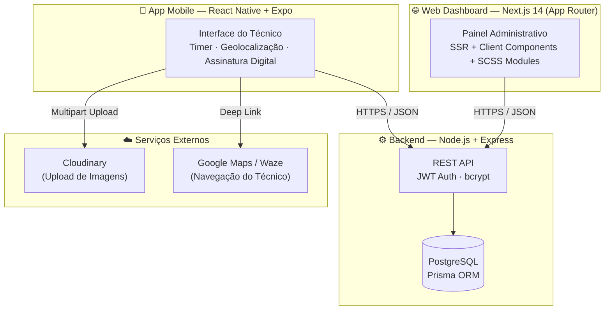

# AlltiControl — Service Order Management SaaS

### *"Engenharia focada na eficiência: Eliminando a burocracia na gestão de Serviços de Informática."*

<p align="center">
  <a href="https://nextjs.org/"></a>
  <a href="https://reactjs.org/"></a>
  <a href="https://reactnative.dev/"></a>
  <a href="https://www.typescriptlang.org/"></a>
  <a href="https://nodejs.org/"></a>
  <a href="https://www.postgresql.org/"></a>
  <a href="https://www.prisma.io/"></a>
  <a href="https://expo.dev/"></a>
</p>

<p align="center">
  
  
  
  
</p>

---


---

## 🎯 O Problema Real

A [**Alltiservice**](https://alltiservice.com.br) é uma empresa de TI terceirizada com 4+ anos de mercado, prestando serviços para prefeituras, escolas e postos de saúde em Mogi das Cruzes/SP. Seus técnicos de campo perdiam horas por dia navegando por **5 a 6 telas diferentes** em sistemas legados para registrar uma única ordem de serviço — gastando mais tempo no software do que no hardware.

**O AlltiControl resolve isso** — construí o sistema internamente para a própria Alltiservice: gestão completa das ordens de serviço em **2 telas**, com app mobile para o técnico em campo e painel estratégico para o gestor. Atualmente em fase de implantação e testes dentro da empresa.

---

## 📈 Impacto em Produção

| Métrica | Antes (Sistema Legado) | Depois (AlltiControl) | Ganho |
|---|---|---|---|
| Telas por OS | 5–6 telas | **2 telas** | **−66% complexidade** |
| Esforço de input | 100% manual/fragmentado | Fluxo otimizado | **−83% esforço** |
| Escala | Local/limitada | Cloud-ready | **130+ unidades** |
| Mobilidade | Zero | App nativo iOS/Android | **100% field-ready** |

- **68 usuários** da Alltiservice cadastrados na plataforma  
- **130+ instituições atendidas** pela Alltiservice (postos de saúde e escolas municipais)  
- **100% das OSs** da equipe técnica da Alltiservice passando pelo sistema  

---

## 🏗️ Arquitetura do Sistema

O AlltiControl opera como um **monorepo com 3 camadas integradas**:



---

## 📁 Estrutura do Projeto

```
allti-control/                        # Monorepo
│
├── Frontend/                         # Next.js 14 — Painel Administrativo Web
│   └── src/
│       ├── app/
│       │   ├── dashboard/            # Rotas protegidas do painel
│       │   │   ├── tickets/          # Lista de OS + filtros + relatório Excel
│       │   │   ├── ticketscount/     # Calendário técnico (DHTMLX Scheduler)
│       │   │   ├── controles/        # Assistência técnica, laboratório, laudos
│       │   │   ├── compras/          # Solicitações de compra
│       │   │   ├── usuarios/         # Gestão de usuários e técnicos
│       │   │   └── formulariosadd/   # Criação de OS e tickets
│       │   ├── components/           # Modais, cards, calendar, sidebar
│       │   └── AreadeUsuario/        # Portal do técnico (formulário de ticket)
│       ├── lib/                      # Tipagens TypeScript, helpers, exportação Excel
│       ├── provider/                 # Context providers (GlobalModal, Compras)
│       └── services/                 # Instância Axios configurada
│
├── Backend/                          # Node.js + Express — API REST
│   ├── prisma/
│   │   ├── schema.prisma             # Modelo de dados completo
│   │   └── migrations/               # Histórico de migrações do banco
│   └── src/
│       ├── controllers/
│       │   ├── controles_forms/      # CRUD de OS, compras, lab, laudos...
│       │   ├── status_categorias/    # Listas de status, tipos, clientes...
│       │   └── user/                 # Auth e gestão de usuários
│       ├── services/                 # Regras de negócio (List, Create, Update...)
│       ├── Middleware/               # Autenticação JWT
│       └── routes.ts                 # Registro centralizado de todas as rotas
│
└── AlltiControl-App/                 # React Native + Expo — App do Técnico
    └── src/
        ├── pages/
        │   ├── Dashboard/            # Lista de OS atribuídas ao técnico
        │   ├── Signin/               # Autenticação com validação de campos
        │   └── ListOrdemdeServicoInterna/
        ├── components/               # Modais de OS, formulários de atendimento
        ├── contexts/                 # Estado global (auth, OS ativa)
        └── services/                 # Chamadas à API com Axios
```

---

## ✨ Funcionalidades

### 💻 Web Dashboard (Next.js)
- Dashboard de OS com status: Aberta, Em Deslocamento, Em Andamento, Pausada, Concluída
- Calendário técnico com drag-and-drop para reagendamento (DHTMLX Scheduler)
- Popup de overflow de eventos por dia (estilo Google Calendar)
- Relatório de OS em Excel (.xlsx) com filtros por período, tarefa, status, tipo, cliente e instituição
- Gestão de clientes, unidades, técnicos e usuários
- Controle de patrimônio: assistência técnica, laboratório, laudos, estabilizadores
- Documentação técnica com assinatura digital
- Autenticação JWT com tokens em cookies HttpOnly

### 📱 Mobile App (React Native + Expo)
- Filtro automático por técnico atribuído (segurança de dados)
- Timer de OS: Iniciar → Pausar → Retomar → Concluir com cálculo de duração real
- Geolocalização com deep link para Waze e Google Maps
- Upload de fotos via `expo-image-picker` + Cloudinary (com prevenção de duplicatas)
- Assinatura digital integrada (`react-native-signature-canvas`)
- Loading overlay e validação de campos no login
- Atualização ao vivo do modal após edição

### ⚙️ Backend (Node.js + Express)
- API REST com mais de 80 endpoints documentados em `routes.ts`
- Autenticação JWT com middleware de proteção por rota
- Criptografia de senhas com bcrypt
- ORM Prisma com PostgreSQL — migrações versionadas
- Exportação de relatórios via ExcelJS com estilização de planilha
- Cache-Control headers para garantir dados frescos (evita 304)
- Suporte a upload multipart (imagens de OS)

---

## 🛠 Stack Tecnológica

| Camada | Tecnologias |
|---|---|
| **Frontend Web** | Next.js 14, React, TypeScript, SCSS Modules, react-select, ExcelJS |
| **Mobile** | React Native, Expo, Context API, AsyncStorage, Axios |
| **Backend** | Node.js, Express, TypeScript, JWT, bcrypt |
| **Banco de Dados** | PostgreSQL, Prisma ORM |
| **Armazenamento** | Cloudinary (imagens) |
| **Calendário** | DHTMLX Scheduler v7 |
| **Deploy Mobile** | Expo EAS Build + EAS Update |

---

## 🚀 Como Rodar Localmente

### Pré-requisitos
- Node.js 18+
- PostgreSQL 14+
- npm ou yarn
- Expo CLI (`npm install -g expo-cli`)

### 1. Backend

```bash
cd Backend
npm install

# Configure as variáveis de ambiente
cp .env.example .env
# Edite o .env com suas credenciais do PostgreSQL e JWT_SECRET

# Rode as migrações do banco
npx prisma migrate dev

# Inicie o servidor
npm run dev
```

### 2. Frontend Web

```bash
cd Frontend
npm install

# Configure as variáveis de ambiente
cp .env.example .env.local
# Edite com a URL do seu backend

npm run dev
# Acesse: http://localhost:3000
```

### 3. App Mobile

```bash
cd AlltiControl-App
npm install

# Configure a URL da API em src/services/api.ts
# Inicie o Expo
npx expo start
```

### Variáveis de Ambiente necessárias

| Variável | Onde | Descrição |
|---|---|---|
| `DATABASE_URL` | Backend | String de conexão PostgreSQL |
| `JWT_SECRET` | Backend | Chave secreta para tokens JWT |
| `CLOUDINARY_URL` | Backend | Credenciais do Cloudinary |
| `NEXT_PUBLIC_API_URL` | Frontend | URL base da API |

---

## 🏁 Contexto de Desenvolvimento

Desenvolvido paralelamente à atuação como **técnico de helpdesk N2 na [Alltiservice](https://alltiservice.com.br)**, o projeto foi validado com os próprios técnicos de campo em cada feature, apresentado à gestão com protótipo funcional de 3 módulos-chave e aprovado para uso interno — resultando em **promoção a Desenvolvedor Fullstack antes de completar 1 ano na empresa**.

Atualmente em fase de implantação e testes dentro da Alltiservice, gerenciando as ordens de serviço das equipes que atendem prefeituras, escolas e postos de saúde em Mogi das Cruzes/SP.

---

## 🔜 Próximos Passos

- [ ] Notificações push no app mobile (Expo Notifications)
- [ ] Transcrição de áudio para documentação técnica (Expo Speech)
- [ ] Validação de schema com Zod nas rotas da API
- [ ] Testes automatizados com Jest (backend) e Playwright (web)
- [ ] Deploy do frontend na Vercel

---

## 📄 Licença

MIT © [Pablo Cruz](https://github.com/pablo-cruzbr)

---

<p align="center">
  <strong>GO GLOBAL OR NOTHING</strong>
</p>
